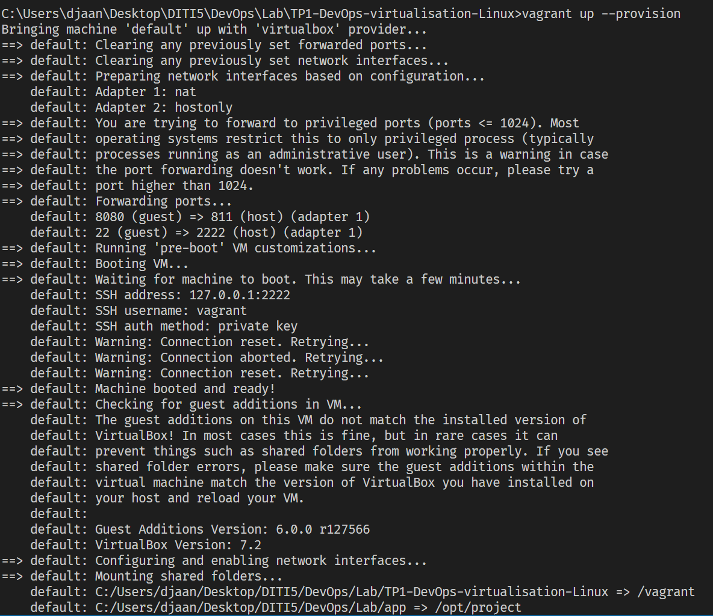
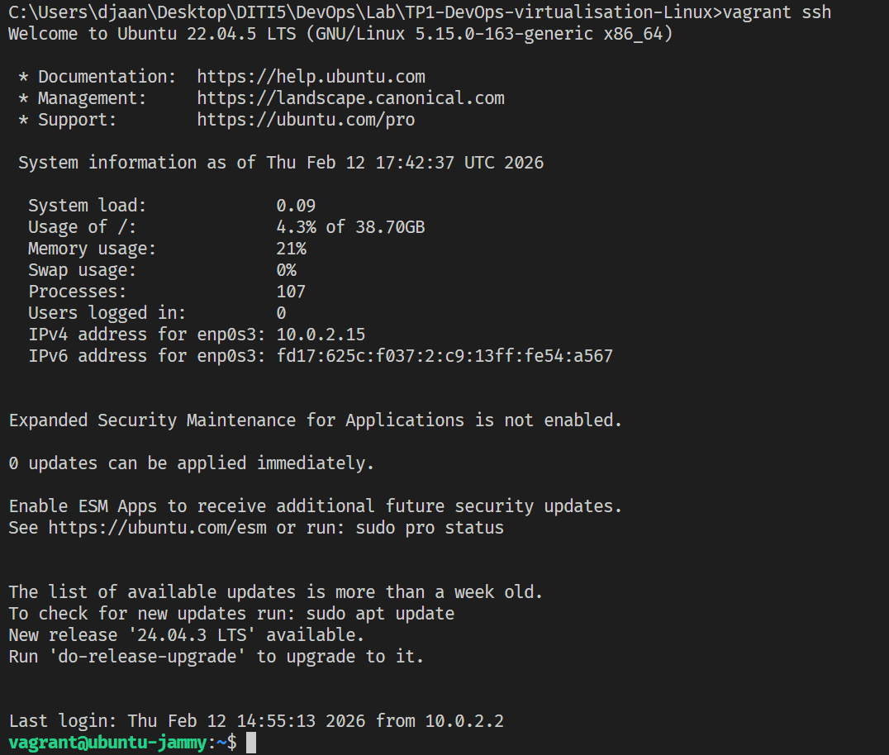
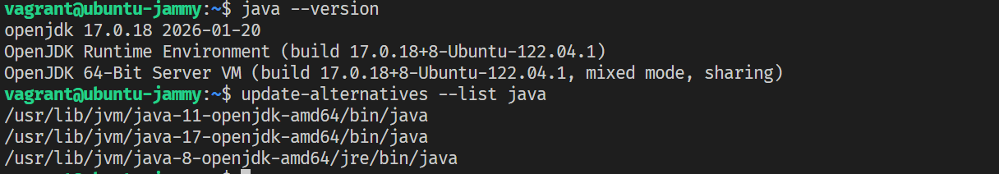
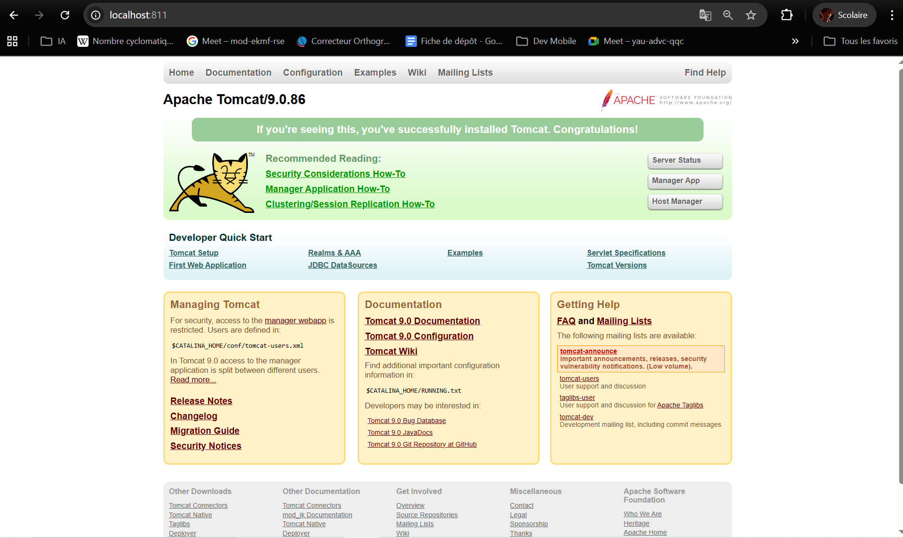
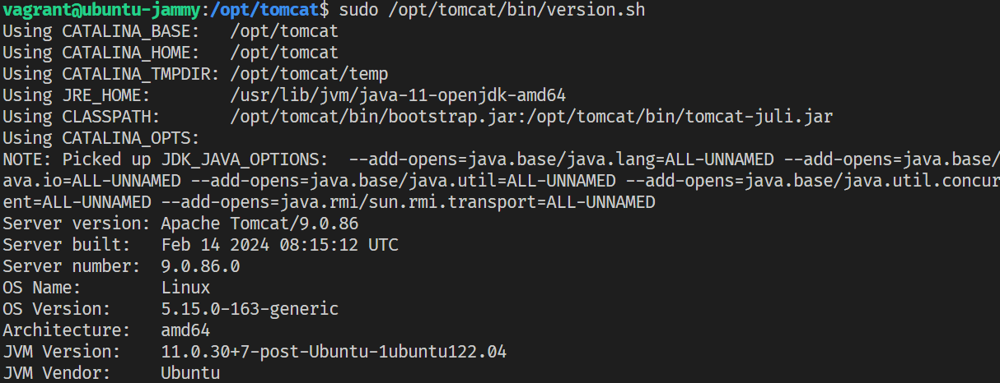
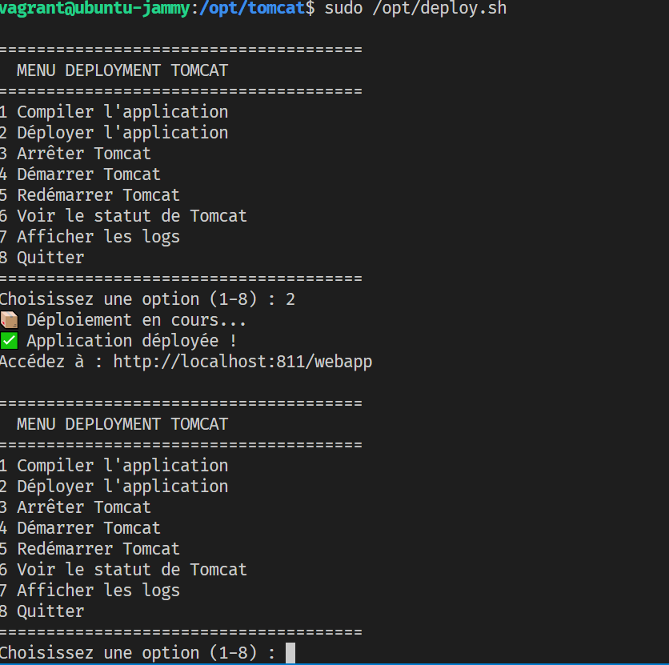
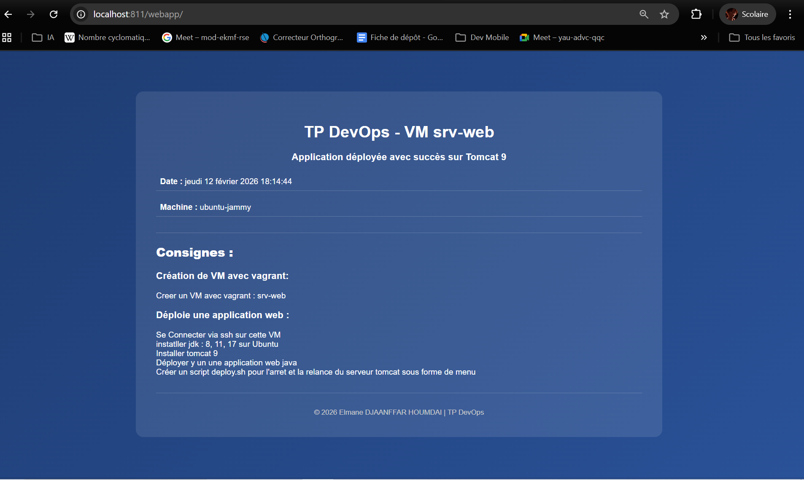

# 🚀 TP DevOps - Virtualisation et Déploiement

Création d'une VM Vagrant avec Tomcat 9 et une application web Java.

---

## 📋 Table des Matières

1. [Prérequis](#prérequis)
2. [Étape 1 : Lancer la VM](#étape-1--lancer-la-vm)
3. [Étape 2 : Installer JDK 8, 11, 17](#étape-2--installer-jdk-8-11-17)
4. [Étape 3 : Installer Tomcat 9](#étape-3--installer-tomcat-9)
5. [Étape 4 : Déployer l'application](#étape-4--déployer-lapplication)
6. [Étape 5 : Tester l'application](#étape-5--tester-lapplication)
7. [Étape 6 : Tester le menu de gestion](#étape-6--tester-le-menu-de-gestion)
8. [Troubleshooting](#troubleshooting)

---

## ✅ Prérequis

- **Vagrant** : 2.4.9+
- **VirtualBox** : Compatible
- **Git** (optionnel)

---

## 🔧 Étape 1 : Lancer la VM

### 1.1 Lancer la VM
```bash
vagrant up --provision
```


### 1.2 Se connecter en SSH
```bash
vagrant ssh
```

---

## 🔧 Étape 2 : Installer JDK 8, 11, 17

### 2.1 Mettre à jour le système
```bash
sudo apt-get update && sudo apt-get upgrade -y
```

### 2.2 Installer les JDK
```bash
sudo apt-get install -y openjdk-8-jdk openjdk-11-jdk openjdk-17-jdk
```

### 2.3 Vérifier les installations
```bash
java -version
update-alternatives --list java
```

---

## 🔧 Étape 3 : Installer Tomcat 9

### 3.1 Télécharger et extraire
```bash
sudo groupadd tomcat
sudo useradd -s /bin/false -g tomcat -d /opt/tomcat tomcat
cd /tmp
wget https://archive.apache.org/dist/tomcat/tomcat-9/v9.0.86/bin/apache-tomcat-9.0.86.tar.gz
sudo tar -xzf apache-tomcat-9.0.86.tar.gz -C /opt/
sudo ln -s /opt/apache-tomcat-9.0.86 /opt/tomcat
cd /opt/tomcat
sudo chgrp -R tomcat /opt/tomcat
sudo chmod -R g+r conf
sudo chmod g+x conf
sudo chown -R tomcat webapps/ work/ temp/ logs/
sudo vi /etc/systemd/system/tomcat.service
>>Contenue du service
[Unit]
Description=Apache Tomcat Web Application Container
After=network.target

[Service]
Type=forking

Environment=JAVA_HOME=/usr/lib/jvm/java-11-openjdk-amd64
Environment=CATALINA_PID=/opt/tomcat/temp/tomcat.pid
Environment=CATALINA_Home=/opt/tomcat
Environment=CATALINA_BASE=/opt/tomcat
Environment='CATALINA_OPTS=-Xms512M -Xmx1024M -server -XX:+UseParallelGC'
Environment='JAVA_OPTS.awt.headless=true -Djava.security.egd=file:/dev/v/urandom'

ExecStart=/opt/tomcat/bin/startup.sh
ExecStop=/opt/tomcat/bin/shutdown.sh

User=tomcat
Group=tomcat
UMask=0007
RestartSec=10
Restart=always

[Install]

WantedBy=multi-user.target
>>Fin
sudo systemctl daemon-reload
sudo ufw allow 8080
sudo ufw app list
sudo /opt/tomcat/bin/startup.sh run
```

### 3.2 Vérifier l'installation
```bash
sudo /opt/tomcat/bin/version.sh
```



---

## 🔧 Étape 4 : Déployer l'Application

### 4.1 Exécuter le script de déploiement automatique
```bash
/opt/deploy.sh
```



### 4.2 Ou manuellement (Option 1 du menu)
```bash
cd /opt/project
mvn clean package
sudo cp target/webapp.war /opt/tomcat/webapps/
sudo /opt/tomcat/bin/shutdown.sh
sleep 2
sudo /opt/tomcat/bin/startup.sh
```

---

## 🌐 Étape 5 : Tester l'Application

### 5.1 Accès via la VM
```
http://192.168.33.12:8080/webapp
```

### 5.2 Accès depuis l'hôte (port forwarding)
```
http://localhost:811/webapp
```

**Capture d'écran attendue :**
> [📸 Page d'accueil]
> - Titre : "TP DevOps - VM srv-web"
> - Message : "✓ L'application fonctionne !"
> - Date et heure affichées
> - Nom de la machine

---

## 🔧 Étape 6 : Tester le Menu de Gestion

### 6.1 Lancer le script
```bash
/opt/deploy.sh
```

**Capture d'écran attendue :**
> [📸 Menu principal]
> ```
> ======================================
>   MENU DEPLOYMENT TOMCAT
> ======================================
> 1 Compiler l'application
> 2 Déployer l'application
> 3 Arrêter Tomcat
> 4 Démarrer Tomcat
> 5 Redémarrer Tomcat
> 6 Voir le statut de Tomcat
> 7 Afficher les logs
> 8 Quitter
> ```

### 6.2 Tester les options
```bash
# Option 3 : Arrêter Tomcat
# Option 4 : Démarrer Tomcat
# Option 6 : Voir le statut
# Option 7 : Voir les logs
```

**Captures d'écran attendues :**
> [📸 Option 3] Tomcat arrêté
> [📸 Option 4] Tomcat démarré
> [📸 Option 6] Statut actif
> [📸 Option 7] Logs en direct

---

## 🛠️ Troubleshooting

### ❌ "VM ne démarre pas"
```bash
vagrant up --debug
```

### ❌ "Tomcat ne démarre pas"
```bash
tail -f /opt/tomcat/logs/catalina.out
```

### ❌ "Application non accessible"
```bash
# Vérifier l'état de Tomcat
ps aux | grep tomcat

# Vérifier les logs
cat /opt/tomcat/logs/catalina.out
```

---

## ⚙️ Configuration Vagrant

| Paramètre | Valeur |
|-----------|--------|
| Box | ubuntu/jammy64 |
| Nom VM | srv-web |
| RAM | 1024 MB |
| CPU | 2 cores |
| IP Privée | 192.168.33.12 |
| Port Tomcat | 8080 → 811 |
| Dossier App | ../app → /opt/project |

---

## 📁 Structure du Projet

```
TP1-DevOps-virtualisation-Linux/
├── Vagrantfile          (Configuration VM)
├── deploy.sh            (Script de gestion automatique)
└── README.md

../app/                   (Application Java)
├── pom.xml
├── README.md
└── src/main/webapp/
    └── index.jsp
```

---

## 🔧 Commandes Utiles

```bash
# Vagrant
vagrant up              # Lancer VM
vagrant ssh             # Connexion
vagrant halt            # Arrêter VM
vagrant destroy         # Supprimer VM

# Tomcat (dans la VM)
sudo /opt/tomcat/bin/startup.sh       # Démarrer
sudo /opt/tomcat/bin/shutdown.sh      # Arrêter
tail -f /opt/tomcat/logs/catalina.out # Logs

# Déploiement
/opt/deploy.sh          # Menu interactif
```

---

## 📝 Notes Importantes

- **Dossier synchronisé :** `app/` (hôte) ↔ `/opt/project` (VM)
- **Port forwarding :** 8080 (VM) → 811 (hôte)
- **Script auto-déploiement :** `/opt/deploy.sh`
- **Application WAR :** `/opt/project/target/webapp.war`
- **Tomcat logs :** `/opt/tomcat/logs/catalina.out`

---

## 🔗 Ressources Utiles

- [Vagrant Documentation](https://www.vagrantup.com/docs)
- [Apache Tomcat 9](https://tomcat.apache.org/tomcat-9.0-doc/)
- [Maven Guide](https://maven.apache.org/guides/)
- [OpenJDK](https://openjdk.org/)

---

**Dernière mise à jour :** 12 février 2026
**Version :** 3.0

---

## ✅ Checklist de Validation

- [ ] VM créée et accessible via SSH
- [ ] JDK 8, 11, 17 installés
- [ ] Tomcat 9 installé et démarré
- [ ] Script `/opt/deploy.sh` exécuté
- [ ] Application accessible via `http://localhost:811/webapp`
- [ ] Menu de déploiement testé (toutes les options)
- [ ] Logs vérifiés (pas d'erreurs)

**TP Réussi ! 🎉**
